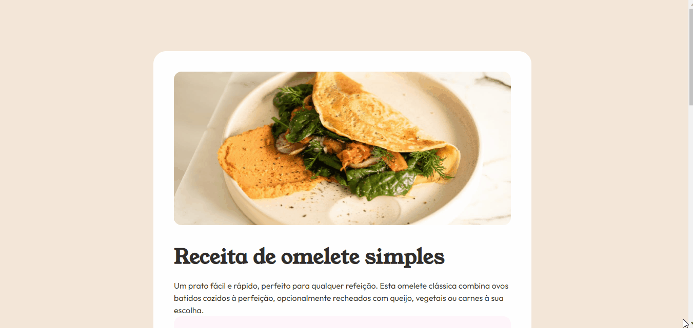
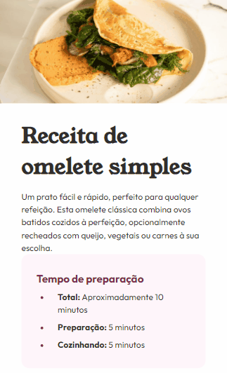
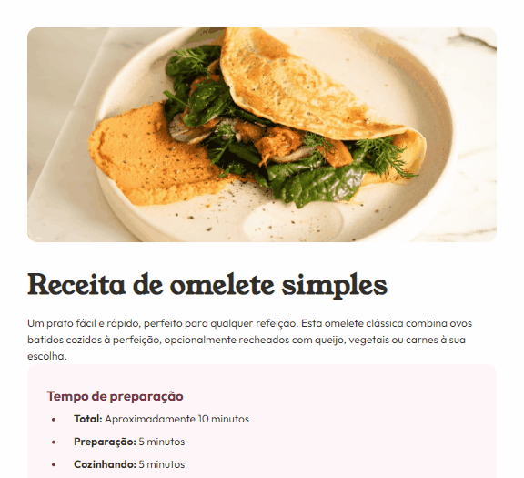

# Página de receita
Essa é uma página de receita desenvolvida, esse projeto tem como base um desafio do [FrontEnd Mentor](https://www.frontendmentor.io/challenges/recipe-page-KiTsR8QQKm/hub).

# Tecnologias utilizadas
- HTML;
- CSS.

# Responsividade
### Mobile
O projeto está responsivo, se comporta bem em dispositivos mobile (425px).

### Tablet
O projeto também está responsivo em tablets (768px).

